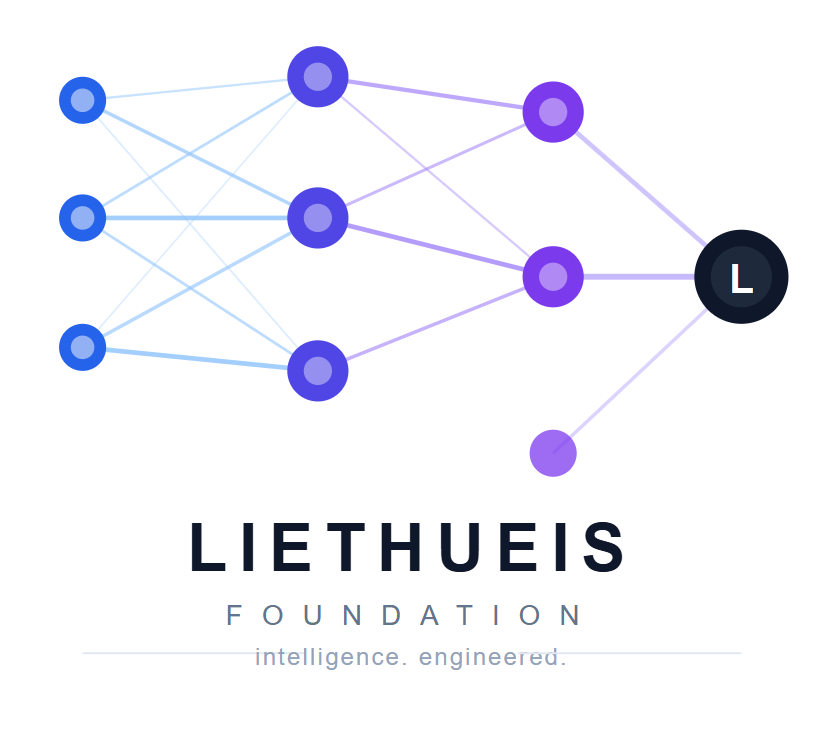

<div align="center">



# TeleVault

### 🔐 Private Cloud Storage Powered by Telegram

**Client-side encrypted file storage with AES-256-GCM, resumable transfers, media streaming, and a native Android application.**

<p>
  <a href="https://github.com/Skyh-23/TeleVault/stargazers">
    
  </a>
  <a href="https://github.com/Skyh-23/TeleVault/network/members">
    
  </a>
  <a href="https://github.com/Skyh-23/TeleVault/blob/main/LICENSE">
    
  </a>
  <a href="https://github.com/Skyh-23/TeleVault">
    
  </a>
</p>

</div>

---

## 📖 Overview

**TeleVault** is a privacy-focused cloud storage application that uses **Telegram as the remote storage layer** while keeping file encryption on the client side.

Instead of uploading your original files directly to remote storage, TeleVault processes them locally, encrypts them using **AES-256-GCM**, splits them into encrypted blocks, and stores those blocks through Telegram.

The application is designed around the idea of keeping the user's encryption material under their control while using Telegram as the underlying storage infrastructure.

> **TeleVault is an independent third-party application and is not affiliated with, endorsed by, or officially connected to Telegram.**

---

## ✨ Features

### 🔐 Security

* AES-256-GCM authenticated encryption
* Argon2id password-based key derivation
* Client-side file encryption
* Encrypted file blocks
* Encrypted vault manifest
* Local vault key management
* Password-protected recovery
* Integrity verification
* No plaintext file upload to Telegram

### ☁️ Telegram Storage

* Uses Telegram as the remote storage layer
* Telegram Saved Messages support
* Private Telegram channel storage
* Encrypted block-based uploads
* File metadata stored through the vault manifest
* Resume-aware transfers

### 📁 File Management

* Folder organization
* Upload and download
* File search
* Move files between folders
* Storage statistics
* Cache management
* Local share management
* Vault import/export

### ⚡ Transfer System

* Block-based file processing
* Resumable uploads
* Resumable downloads
* Transfer progress events
* Integrity verification
* Large-file oriented architecture

### 🎬 Media

* Media previews
* Thumbnail generation
* Thumbnail caching
* Decrypted media streaming
* Support for accessing encrypted media without storing plaintext remotely

### 🖥️ Desktop

* React + TypeScript frontend
* Python backend
* FastAPI API
* Uvicorn server
* PyWebView desktop shell
* PyInstaller Windows packaging

### 📱 Android

* Native Android application
* Kotlin
* Jetpack Compose
* Chaquopy
* Bundled Python core
* Designed around the same TeleVault storage concepts

> Android is currently under active development and may not have complete feature parity with the desktop application.

---

# 🧠 How TeleVault Works

TeleVault separates the application, encryption, and storage layers.

```text
┌─────────────────────────────────────┐
│             TeleVault               │
│       Desktop / Android App         │
└──────────────────┬──────────────────┘
                   │
                   ▼
┌─────────────────────────────────────┐
│         Local File Processing       │
│                                     │
│  File → Blocks → AES-256-GCM        │
└──────────────────┬──────────────────┘
                   │
                   ▼
┌─────────────────────────────────────┐
│       Encrypted Storage Layer       │
│                                     │
│   Encrypted Blocks + Manifest       │
└──────────────────┬──────────────────┘
                   │
                   ▼
┌─────────────────────────────────────┐
│             Telegram                │
│        Remote Storage Layer         │
└─────────────────────────────────────┘
```

### Upload

```text
Original File
      │
      ▼
Split Into Blocks
      │
      ▼
Encrypt Locally
      │
      ▼
Encrypted Blocks
      │
      ▼
Upload to Telegram
      │
      ▼
Update Encrypted Manifest
```

### Download

```text
Encrypted Manifest
      │
      ▼
Locate Required Blocks
      │
      ▼
Download Encrypted Blocks
      │
      ▼
Decrypt Locally
      │
      ▼
Verify Integrity
      │
      ▼
Reconstruct Original File
```

The important design principle is:

> **Files are encrypted locally before being uploaded to the remote storage layer.**

---

# 🔐 Security Model

TeleVault currently uses:

| Component       | Technology         |
| --------------- | ------------------ |
| Encryption      | AES-256-GCM        |
| Key Derivation  | Argon2id           |
| Storage         | Telegram           |
| File Processing | Block-based        |
| Metadata        | Encrypted Manifest |

### Local Secrets

The following files/data should never be committed to Git:

```text
vault.key
*.session
api_id.txt
api_hash.txt
metadata.db
backend/data/
android/local.properties
```

Treat Telegram session files as credentials.

Treat the vault key as highly sensitive.

### Recovery

TeleVault provides encrypted vault recovery functionality.

Keep your recovery backup somewhere secure and separate from your primary device.

If the vault key is lost and there is no valid recovery backup, encrypted data may become unrecoverable.

---

# 🏗️ Architecture

## Desktop

```text
┌─────────────────────────┐
│ React + TypeScript      │
│ Frontend                │
└────────────┬────────────┘
             │
             ▼
┌─────────────────────────┐
│ FastAPI                 │
│ Python Backend          │
└────────────┬────────────┘
             │
      ┌──────┼──────────┐
      │      │          │
      ▼      ▼          ▼
   Vault   Crypto    Transfers
      │      │          │
      └──────┼──────────┘
             │
             ▼
        Telethon
             │
             ▼
         Telegram
```

## Android

```text
┌─────────────────────────┐
│ Kotlin + Jetpack        │
│ Compose UI              │
└────────────┬────────────┘
             │
             ▼
┌─────────────────────────┐
│ Android Command Layer   │
└────────────┬────────────┘
             │
             ▼
┌─────────────────────────┐
│ Python Core             │
│ Chaquopy                │
└────────────┬────────────┘
             │
             ▼
        Telegram
```

---

# 🛠️ Technology Stack

| Component              | Technology               |
| ---------------------- | ------------------------ |
| Frontend               | React + TypeScript       |
| Backend                | Python                   |
| API                    | FastAPI                  |
| Server                 | Uvicorn                  |
| Telegram Client        | Telethon                 |
| Encryption             | AES-256-GCM              |
| KDF                    | Argon2id                 |
| Desktop Shell          | PyWebView                |
| Windows Packaging      | PyInstaller              |
| Android UI             | Kotlin + Jetpack Compose |
| Android Python Runtime | Chaquopy                 |

---

# 📂 Project Structure

```text
TeleVault/
│
├── backend/
│   ├── main.py
│   ├── server.py
│   ├── config.py
│   └── ...
│
├── frontend/
│   ├── src/
│   ├── package.json
│   └── ...
│
├── android/
│   ├── app/
│   ├── tools/
│   └── ...
│
├── API.md
├── BUILD_INSTRUCTIONS.md
├── DOCUMENTATION.md
├── GITHUB_SETUP.md
├── QUICK_START.md
├── SECURITY.md
├── TROUBLESHOOTING.md
├── solution_for_speed.md
├── LICENSE
├── build.py
├── requirements.txt
└── README.md
```

---

# 🚀 Getting Started

## Requirements

### Desktop

* Python **3.10+**
* Node.js **18+**
* Git
* Telegram account
* Telegram API ID
* Telegram API hash

### Android

* Android Studio
* Android SDK
* Python 3.12 for the dependency-packaging workflow
* Android build environment required by the project

---

## 📥 Clone the Repository

```bash
git clone https://github.com/Skyh-23/TeleVault.git
cd TeleVault
```

---

## 🐍 Install Backend Dependencies

```bash
pip install -r requirements.txt
```

---

## 📦 Install Frontend Dependencies

```bash
cd frontend
npm install
```

---

## ▶️ Start Frontend

```bash
npm run dev
```

---

## ▶️ Start Backend

Open another terminal in the repository root:

```bash
python backend/main.py --dev
```

The local backend normally runs at:

```text
http://127.0.0.1:8765
```

---

# 🪟 Build Windows Application

From the repository root:

```bash
python build.py
```

The packaged application is generated inside:

```text
dist/
```

For detailed build information:

**[BUILD_INSTRUCTIONS.md](BUILD_INSTRUCTIONS.md)**

---

# 📱 Android Build

From the repository root:

```powershell
cd android
.\tools\vendor-python-deps.ps1
```

Then open the `android/` directory in Android Studio.

If Android Studio cannot find the Android SDK, configure:

```text
android/local.properties
```

using:

```text
android/local.properties.example
```

> Never commit `local.properties`.

---

# 🔑 Telegram API Configuration

TeleVault requires a Telegram API ID and API hash for Telegram connectivity.

Keep these credentials private.

Never commit:

```text
api_id
api_hash
*.session
```

to the repository.

---

# 📚 Documentation

| Document                                       | Description                                  |
| ---------------------------------------------- | -------------------------------------------- |
| [QUICK_START.md](QUICK_START.md)               | Quick setup                                  |
| [BUILD_INSTRUCTIONS.md](BUILD_INSTRUCTIONS.md) | Desktop and Android build instructions       |
| [DOCUMENTATION.md](DOCUMENTATION.md)           | Technical architecture                       |
| [API.md](API.md)                               | Backend API reference                        |
| [SECURITY.md](SECURITY.md)                     | Security guidelines                          |
| [TROUBLESHOOTING.md](TROUBLESHOOTING.md)       | Common problems                              |
| [GITHUB_SETUP.md](GITHUB_SETUP.md)             | Repository maintenance and security          |
| [solution_for_speed.md](solution_for_speed.md) | Encryption and performance engineering notes |

---

# ⚠️ Security Disclaimer

TeleVault has **not been independently audited by a professional security organization**.

Using AES-256-GCM and Argon2id does not automatically guarantee that the entire application is secure.

Security depends on the complete implementation, local device security, credentials, dependencies, Telegram, and operational practices.

Do not use a development build as the only copy of important or irreplaceable data.

---

# ⚠️ Telegram Disclaimer

TeleVault is an independent third-party application.

It is **not affiliated with, endorsed by, or officially connected to Telegram**.

Telegram and related trademarks belong to their respective owners.

TeleVault uses Telegram through its available APIs and libraries as a storage backend.

---

# 📊 Project Status

TeleVault is currently under active development.

### Desktop

**Primary implementation**

### Android

**Active development**

The Android application is being developed toward broader feature parity with the desktop version.

Storage formats, APIs, and internal implementation details may change during development.

---

# 🤝 Contributing

Contributions, bug reports, suggestions, and pull requests are welcome.

Before submitting changes:

1. Test the affected functionality.
2. Do not commit credentials or private data.
3. Keep security-sensitive changes documented.
4. Update documentation when APIs or behavior change.
5. Keep pull requests focused.

---

# 📜 License

TeleVault is licensed under the **MIT License**.

See [LICENSE](LICENSE) for the complete license text.

---

<div align="center">

### 🔐 TeleVault

**Private storage. Client-side encryption. Your files.**

⭐ If you find TeleVault interesting, consider giving the repository a star.

</div>
